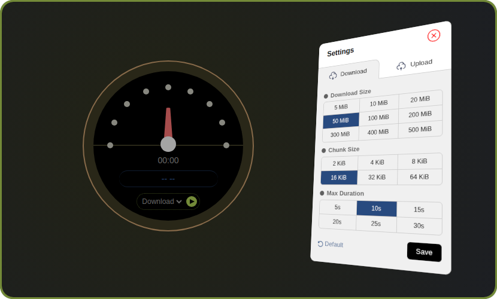

# byrate

A fully self-contained, portable, self-hosted internet speed test tool written in Go. Easily measure download and upload performance without any external dependencies or third-party services—just run the binary and test. I mainly developed it to test the network speed to different VPS providers.



## Download

```bash
curl -sL https://dipakw.github.io/@/byrate-dl | sh
```

## Get Started

Download the appropriate binary file for your OS from [releases](https://github.com/dipakw/byrate/releases) or the commands above.

| Description                               | Example                                |
|-------------------------------------------|----------------------------------------|
| Default start (starts on `[::]:14000`)    | `byrate`                               |
| Custom host / port                        | `byrate s -h=localhost -p=15000`       |
| On a Unix socket                          | `byrate s -u -h=/tmp/byrate.sock`      |

## CLI Usage

```
Usage:
  byrate <command> [options]

Commands:
  version, v   Show version
  start, s     Start the server (default)
  help, h      Show this help message

Options:
  --host, -h    Server host (default: ::)
  --port, -p    Server port (default: 14000)
  --unix, -u    Use unix socket instead of TCP

Notes:
  - All options can use either --long or -short forms.
```

## Disclaimer

This tool provides **approximate internet speed test results** for general informational purposes only. Actual performance may vary due to factors like network traffic, server load, or configuration.

**Important Notes:**
- Results are rough averages, not guaranteed measurements
- Not suitable for contracts, SLAs, or dispute resolution
- Use at your own risk – no liability for decisions based on results
- For reliable insights, test multiple times using different tools
- This is a self-hosted tool; local network setup affects accuracy

Provided “as is” with no warranties of any kind.
